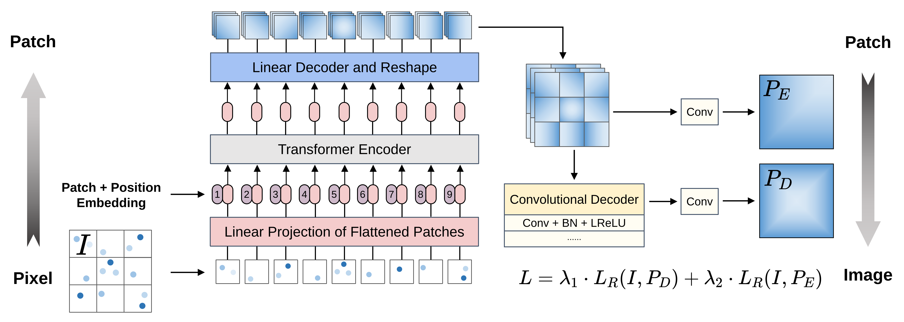
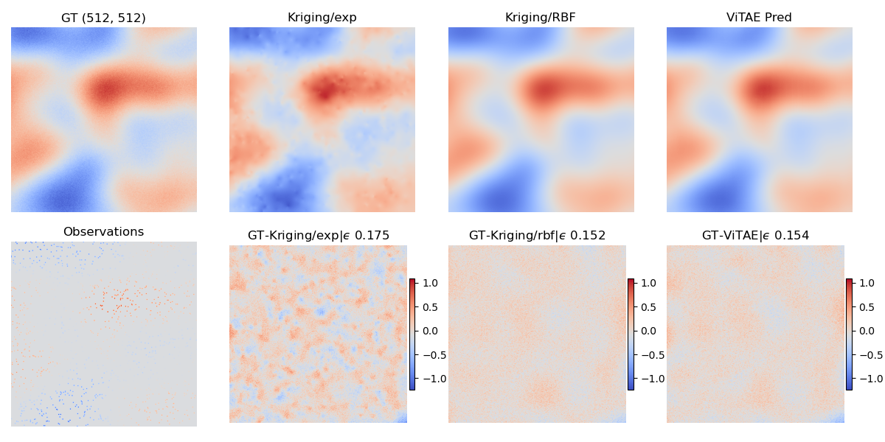
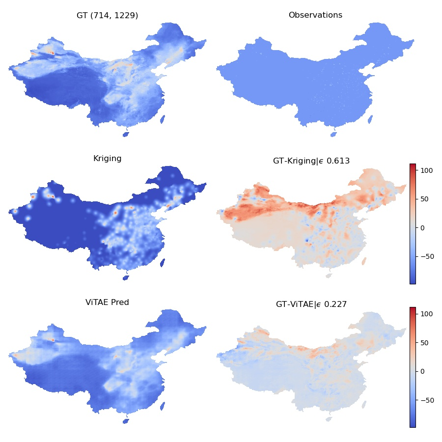
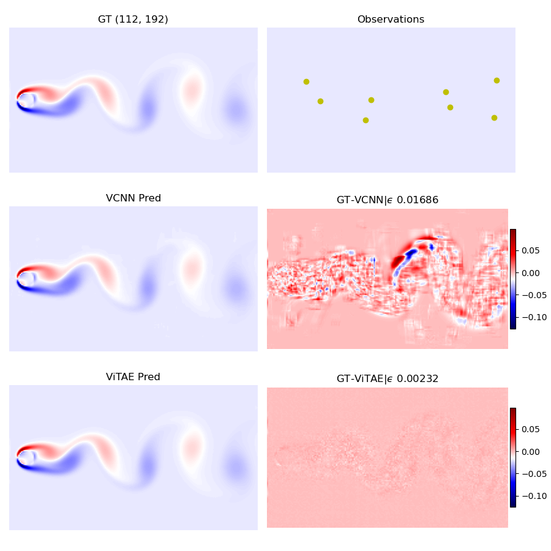
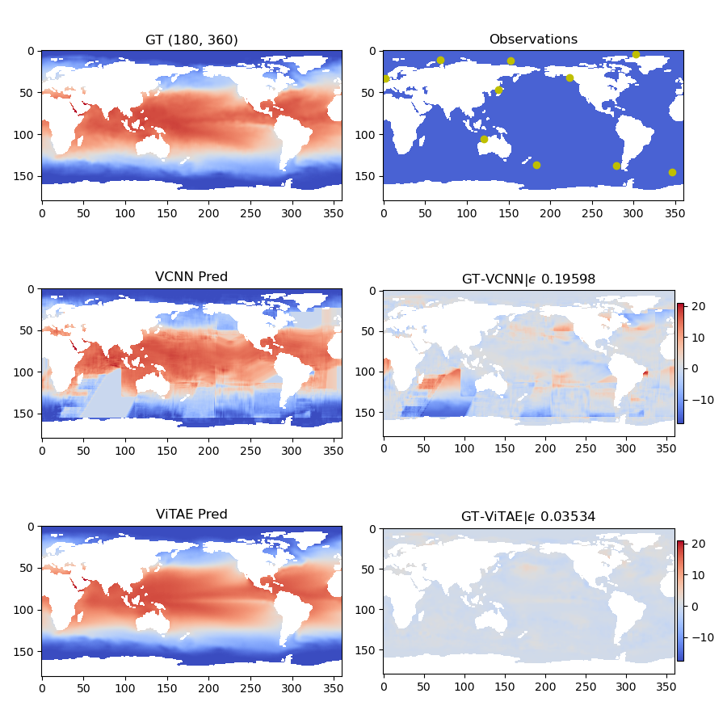
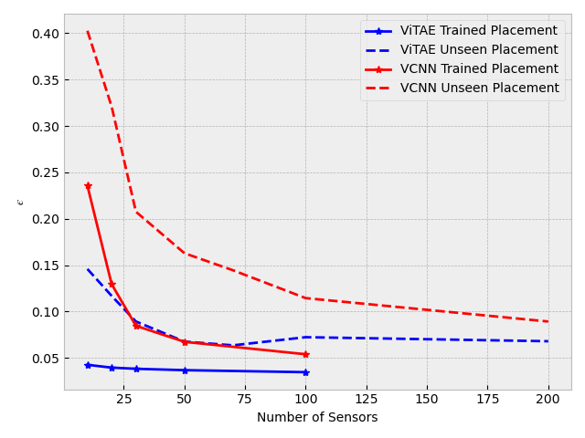

# ViT-based Autoencoder for Field Reconstruction

## 1. Introduction

* We propose a novel vision-transformer-based autoencoder (ViTAE) for field reconstruction with time-varying, sparse, and unstructured observation data.
* Unlike traditional Gaussian process approaches (e.g., Kriging), no prior knowledge, such as covariance kernel and correlation length, is required in ViTAE.
* Extensive numerical experiments with four test cases show the advantage of the proposed ViTAE compared to state-of-art deep learning approache. 
* We compared ViTAE to Kriging and Voronoi tessellation-assisted CNN in terms of both computational efficiency and reconstruction accuracy.

## 2. Environment

```bash
conda create --name vitae python=3.8
conda activate vitae

pip install torch==1.10.1+cu113 torchvision==0.11.2+cu113 -f https://download.pytorch.org/whl/cu113/torch_stable.html
pip install -r requirements.txt
```

## 3. Dataset

Generating dataset according to ```simulation```, ```voronoicnn``` and ```aq_highres```.

|             Dataset              |  Shape  | Source | Comment                                               |
| :------------------------------: | :-----: | :----: | :---------------------------------------------------: |
| simu512 | 512x512 | 10000 |  sp=(0.05, 0.02, 0.01, 0.005) |
|   cylinder    | 112x192 |  5000  |  Dataset in VCNN |
|     noaa      | 180x360 |  1914  |  Dataset in VCNN |
| PM2.5_res5km | 714x1229| 2922| resolution 5km |
| PM2.5_res10km | 357x615 | 2922 | resolution 10km |
| PM2.5_res20km | 184x312 | 2922 | resolution 20km |


## 4. Training

Architecture:




Run the script  to train ViT-AE model for Simulation, Chinese Air Quality, Unsteady wake flow and NOAA :
```bash
./scripts/simu512/train_single.sh    # for 512x512 stimulation dataset
./scripts/aq_highres/train_single.sh # for Chinese Air Quality dataset
./scripts/noaa/train_single.sh       # for NOAA dataset
./scripts/cylinda/train_single.sh    # for unsteady wake flow dataset
```


## 5. Evaluation

Metric for evaluation as  [1]: **ε  = L<sub>2</sub>Norm(T<sub>gt</sub> − T<sub>pred</sub>) / L<sub>2</sub>Norm(T<sub>gt</sub>)**

**T<sub>gt</sub>**: Ground truth, **T<sub>pred</sub>**: Prediction of ViTAE model or Voronoi-CNN (V-CNN) or Kriging interpolation

### 5.1 Simulation

Results of test data of ```simu512``` are listed below:

|   Method    |  ε | ε |  ε | ε | Execution time | Execution time | Execution time |  Execution time |
| :---------: | :------------:| :-----------:| :----------:  | :----------: | :----------:  | :------------:  | :----------:  | :------------: |
| Kriging/RBF | 0.2243 | 0.2221 | 0.2218 | 0.2215| 21 | 59 | 191 | 1491 |
| Kriging/Exp | 0.2553| 0.2552 | 0.2550  | 0.2379 |31 | 76 | 253 | 1586 |
| VCNN          | 0.2324 |  0.2259| 0.2216 |**0.2160**|0.035  | 0.035 | 0.035 |0.035 |
| ViTAE-lite/16 |0.2431 | 0.2346 | 0.2290 | 0.2242| 0.0105 | 0.0104 | 0.0105 | 0.0106 |
| ViTAE-base/16 | 0.2280 | 0.2369 | 0.2250 | 0.2234|0.0128 | 0.0127 | 0.0128 | 0.0128 |
| ViTAE-large/16| **0.2255**|**0.2228**| **0.2213** |	0.2202|0.0150 | 0.0154 | 0.0151 | 0.0153 |
|Sampling Percent|  0.5% | 1% | 2% | 5% | 0.5% | 1% | 2% | 5% |

Performances of ViTAE, VCNN and Kriging for different observation density of simulation field reconstruction.



### 5.2 Chinese air quality

Results of test data of ```Chinese air quality``` are listed below:

| Model           | ε               | ε               | ε               |  SSIM          | SSIM            | SSIM            | PSNR             | PSNR             | PSNR             |Execution time (s) |
|:---------------:|:----------------:|:---------------:|:----------------:|:-------------:|:---------------:|:---------------:|:----------------:|:-----------------:|:-----------------:|:--------------:|
| Kriging         | 0.8599          | 0.8195          | 0.5520          |  0.7788        | 0.8195          | 0.8517          | 24.0098          | 25.0369          | 25.8168          |117.5        |
| VCNN            | 0.3978          | 0.3527          | 0.3261          |  0.9385        | 0.9340          | 0.9321          | 29.7478          | 30.3167          | 30.4041          |0.0063       |
| ViTAE-lite      | 0.3571          | 0.3389          | 0.3245          |  0.9421        | 0.9330          | 0.9271          | 30.8184          | 30.8221          | 30.4489          |0.0053       |
| ViTAE-base      | 0.3570          | 0.3434          | 0.3129          |  0.9451        | 0.9366          | 0.9377          | 30.9079          | 30.7691          | 30.8588          |0.0058       |
| ViTAE-large     | **0.3566**      | **0.3371** | **0.3205** |  **0.9471** | **0.9399** | **0.9304** | **30.9466** |**30.9628** | **30.6220** |0.0061       |
| Monitor Percent | 0.13%          | 0.52%          | 2.08%          |  0.13%         | 0.52%           | 2.08%           | 0.13%            | 0.52%            | 2.08%            |0.13%       |


Performances of ViTAE, VCNN and Kriging for different observation density of Chinese air quality


### 5.3 Unsteady wake flow

Results of test data of ```Unsteady wake flow``` are listed below:

| Model         | ε   | ε      | ε       | Execution time (s) |
|---------------|---------------|----------------|-----------------|----------------------|
| VCNN          | 0.0230        | 64.55          | 0.9988          | 0.0016               |
| ViTAT-lite/8  | 0.0112        | 70.63          | 0.9988          | 0.0043               |
| ViTAE-base/8  | 0.0050        | 77.56          | 0.9999          | 0.0050               |
| ViTAE-large/8 | **0.0023** | **84.37** | **0.9988** | 0.0052               |

Performances of ViTAE and VCNN for different observation density of Unsteady wake flow


### 5.4 NOAA

Performances of ViTAE and NOAA for sparse observations.



NOAA field reconstruction performances of ViTAE and VCNN for various input observations.


